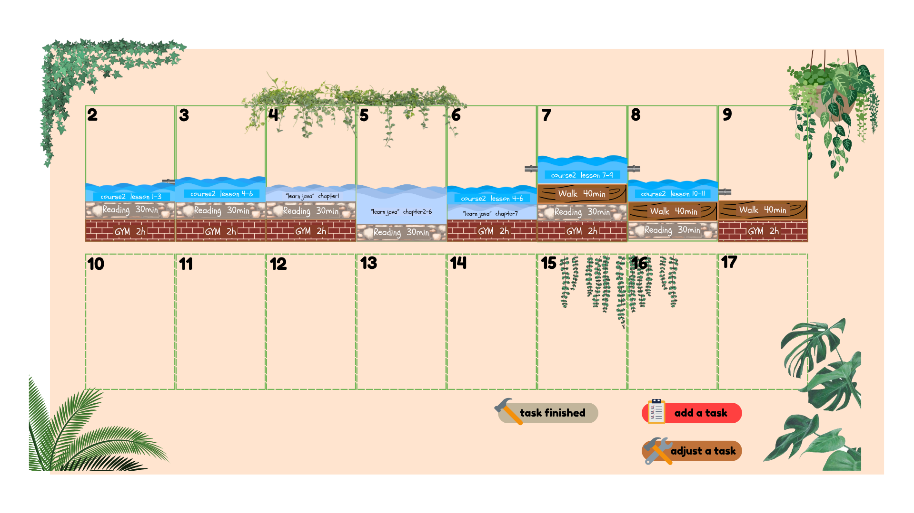
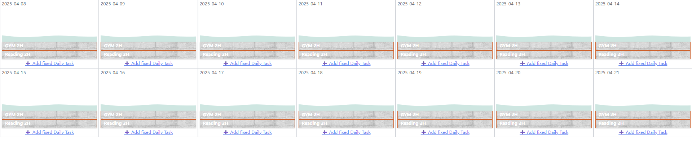

# 🧱💧 水砖日历（Water-Brick Calendar）

在我准备期末考试的时候，我灵感迸发，开发了这款名为 **水砖日历** 的创新型每周计划应用。这个 App 采用了两个强有力的隐喻：砖块和水。

- 🧱**砖块**：代表你每天的固定任务——例如跑步、阅读等维持日常节奏的重要事项。
- 💧**水**：象征那些灵活的、可跨天调整的任务，使你的时间安排更具弹性与创造性。

通过这种动态的双重比喻结构，**水砖日历** 既能帮助你为日常活动打下稳定的基础，又能支持你灵活地调整任务进度，让你轻松应对未完成事项，而无需被死板的截止时间束缚。体验自由规划，重新掌控你的时间！

## 🌟 功能亮点

- 每天显示为一个方格单元
- 固定任务以“砖块”堆叠在方格底部
- 连续性任务以“水”流形式跨越多日，可按百分比分配  
    > 例如你要读一本 10 章的书，原本计划周一读前 5 章（50%），周二读后 5 章（50%）。如果周一有临时活动，可以把任务比例改为 30%，只读前 3 章，剩下 20% 移到周二。这种方式让你依然按计划推进而不焦虑。

- 点击砖块触发锤子砸碎的动画
- 未完成的“水任务”可通过用户输入重新分配到接下来的日期
- 每条“水任务”拥有独特的颜色区分
- 流畅的 UI 动效：包括砖块掉落、水流重分配与任务编辑

## ✅ 示例展示



## 📦 项目结构

```
water-brick-calendar/
├── public/
├── src/
│   ├── components/     # UI 组件（DayBox、Modal、WaterWave 等）
│   ├── data/           # 示例任务数据
│   └── App.jsx         # 主界面入口
├── main/               # Electron 主进程文件夹（未来扩展用）
├── package.json
└── README.md
```

## 🚀 使用方式

1. 克隆本仓库  
2. 安装依赖：`npm install`  
3. 启动开发服务器：`npm run dev`

## 🛣️ 开发计划

- [x] 每周日历视图，支持砖块与水表示
- [x] 砖块击碎动画
- [ ] 基础水流波动动画
- [x] 支持任务添加与编辑
- [ ] 月视图切换
- [ ] 智能水任务自动再分配
- [ ] 更精美的背景和动画体验
- [ ] 用户登录系统

## 👀 当前开发阶段界面


